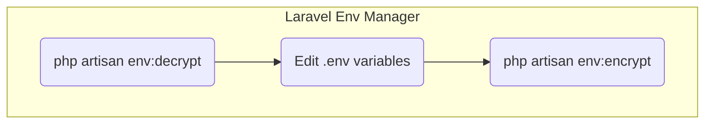

# Laravel Env Manager

暗号化した環境変数設定ファイルを編集して再暗号化するときに `env` や `key` の指定を間違えるのを防ぐための artisan コマンドです。



## Install

```bash
composer require --dev mumincacao/laravel-env-manager
```

## Usage

```bash
php artisan env:manager <environment> [--clean]

# Example for staging environment
php artisan env:manager staging
```

- コマンドを実行すると最初に暗号化したときに設定された暗号化キーの入力を求められます。
    - 暗号化キーは環境変数 `ENV_MAN_ENCRYPTION_KEY` で指定することもできます。誤爆を防ぐため `env:decrypt` で使用できる `LARAVEL_ENV_ENCRYPTION_KEY` とは別の環境変数を使用しています。
- 初回など暗号化したファイルが存在しない場合は、そのまま Enter を押すと保存時に新しいキーを生成することができます。
- `.env` ファイルの優先順位は以下の通りです。 どれも見つからない場合はエラーになります。
  1. `.env.{environment}.encrypted`
  2. `.env.{environment}`
  3. `.env.example` (`.env.example` を `.env.{environment}` にコピーして使用します)
- `.env` ファイルの読み込みに成功すると編集モードに入ります。
    - `help`: 利用可能なコマンドの一覧が表示されます。
    - `list`: 現在の環境変数と変更内容の一覧が表示されます。
    - `changes`: 変更された環境変数の一覧が表示されます。
    - `set`: 環境変数の値を設定します。
    - `delete`: 環境変数を削除します。
    - `reset`: すべての環境変数をリセットします。
    - `finish`: 編集を終了します。
- 編集モードを終了すると、保存していいかの確認が表示されます。
    - 更新内容が無い場合は確認なしで終了します。
    - 保存しないを選択した場合は、変更内容が破棄されます。
    - 保存するを選択した場合は、`php artisan env:encrypt` を実行して暗号化されたファイルを保存します。
    - 新規作成作成で暗号化キーを指定しなかった場合は、このときに新しいキーを自動で作成するか入力するかの確認が表示されます。
- `--clean` オプションを付けると `php artisan env:encrypt` を `--prune` オプション付きで実行します。

## Restrictions

- `.env.{environment}.encrypted` ファイルが存在する場合、`.env.{environment}` ファイルは上書きされます。
- キーに使用できる文字は大文字アルファベット、数字、アンダースコアのみです。
- キーの並び順はキーのアルファベット順になります。
- コメントや空行は保存されません。
- 変数の値に改行を含めることはできません。
- `${VAR_NAME}` のような変数展開はサポートされていません。
